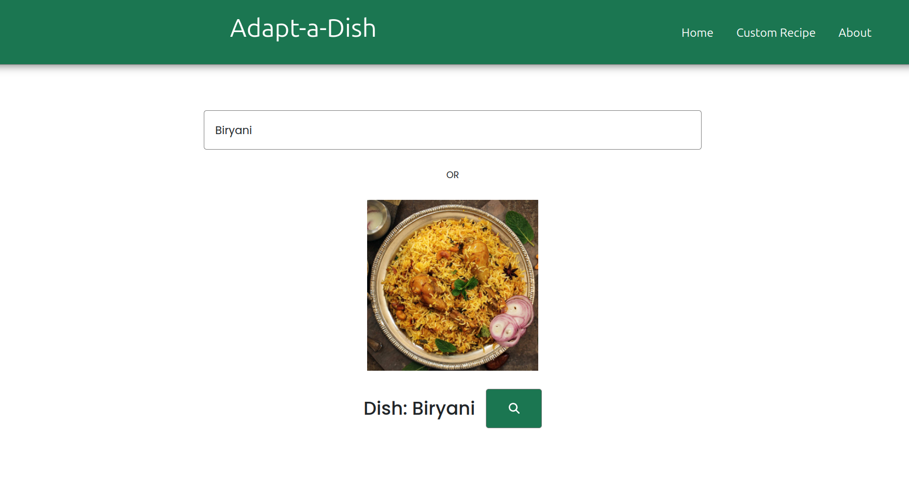
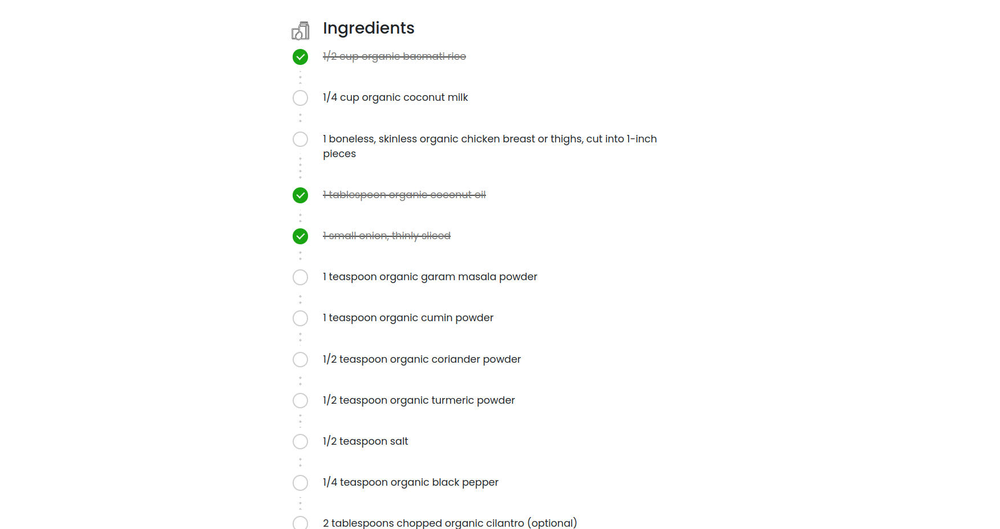

# Context-Aware Recipe Generator

**Adapt-a-dish** is an AI-powered recipe transformation assistant that customizes recipes based on dietary preferences, skill level, and serving size. Whether you're vegan, gluten-free, or exploring healthier options, Adapt-a-dish adapts your favorite recipes into personalized culinary masterpieces.  

It uses a fine-tuned Vision Transformer (ViT) model with LoRA (Low-Rank Adaptation) for image-based recognition and incorporates user-defined contexts (e.g., "vegan", "low-calorie") to customize recipe results. The app fetches recipe data using the Tavily search API and generates detailed recipes through a LLaMA model accessed via the Groq API. For customizing recipes, the system uses ChromaDB and Ollama for ingredient substitution and recipe transformation.

---

## 🚀 Features

- **Image-Based Dish Recognition**: Upload an image to identify a dish using a fine-tuned ViT model with LoRA.
- **Text-Based Dish Input**: Input a dish name directly for recipe generation.
- **Context-Aware Filtering**: Customize recipes with specific dietary contexts:
  - Vegan
  - Low-calorie
  - High-protein, etc.
- **Recipe Generation**: Generates recipes with ingredients and step-by-step instructions using Tavily's search API and LLaMA 3.1 provided by the Groq API.
- **User-Friendly Interface**: Simple and interactive frontend developed in Angular.

### For Customizing Recipes:
- **Ingredient Substitution**: Uses ChromaDB for finding suitable ingredient replacements.
- **Recipe Transformation**: Ollama is used for transforming recipes based on dietary preferences and skill level.

---

## 📚 How It Works  

1. **User Input**:  
   - Provide the dish name, dietary preferences (e.g., vegan, gluten-free), serving size, and a recipe to adapt.  

2. **AI Query**:  
   - The system uses the provided dish name and preferences to retrieve substitution ideas and context.  

3. **Recipe Transformation**:  
   - The recipe is adjusted with dietary-friendly ingredients and cooking instructions tailored to the skill level.  

4. **Output**:  
   - The system generates a personalized recipe with detailed ingredients and instructions.  

---

## 🛠️ Tech Stack

- **Backend**:
  - FastAPI, Ollama, ChromaDB, PyTorch, LangChain, Transformers, Torchvision
- **Frontend**:
  - **Framework**: Angular
- **APIs**:
  - **[Tavily API](https://tavily.com/)**: For finding relevant recipes.
  - **[Groq API](https://groq.com/) (LLaMA)**: For generating detailed recipe content.
- **Dependencies**:
  - `torch`, `transformers`, `langchain`, `fastapi`, `pydantic`, `torchvision`, `ollama`, `chromadb`, etc.

---

## 📋 Installation

1. **Clone the Repository**:
   ```bash
   git clone https://github.com/Atul-AI08/Context-Aware-Recipe-Generator.git
   cd Context-Aware-Recipe-Generator
   ```

2. **Finetune ViT**:
   Ensure Python 3.8+ is installed along with required libraries, then run:
   ```bash
   cd backend/vit/
   python finetune_vit.py
   ```
   Dataset Used: [The-massive-Indian-Food-Dataset](https://www.kaggle.com/datasets/anshulmehtakaggl/themassiveindianfooddataset)

3. **Set Up APIs**:
   Create API keys for Tavily and Groq

4. **Run the Backend**:
   ```bash
   cd backend/vit/
   python dish_detect.py
   cd ../generation/
   ollama serve
   python main.py
   ```

5. **Run the Frontend**:
   Navigate to the Angular project directory and start the development server:
   ```bash
   cd frontend
   npm i
   ng serve
   ```

---

## 🌐 Example Images

### Input and Recognition

*Example of image upload for dish recognition.*

### Context Selection

*Interface for selecting dietary preferences.*

### Recipe Output


*Generated recipe with ingredients and instructions.*

---

## 📄 License
This project is licensed under the MIT License. See the [LICENSE](./LICENSE) file for more details.

---

## 🤝 Contributing
Contributions are welcome! Fork the repository and submit a pull request for review.
