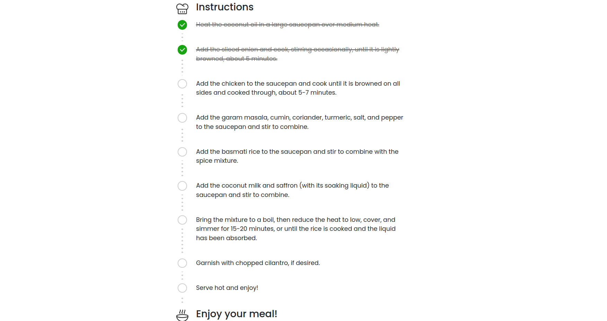

# Context-Aware Recipe Generator

## Overview

The **Context-Aware Recipe Generator** is an intelligent web application that suggests recipes based on dish names or images. It uses a fine-tuned Vision Transformer (ViT) model with LoRA (Low-Rank Adaptation) for image-based recognition and incorporates user-defined contexts (e.g., "vegan", "low-calorie") to customize recipe results. The app fetches recipe data using the Tavily search API and generates detailed recipes through a LLaMA model accessed via the Groq API.

## Features

- **Image-Based Dish Recognition**: Upload an image to identify a dish using a fine-tuned ViT model with LoRA.
- **Text-Based Dish Input**: Input a dish name directly for recipe generation.
- **Context-Aware Filtering**: Customize recipes with specific dietary contexts:
  - Vegan
  - Low-calorie
  - High-protein, etc.
- **Recipe Generation**: Generates recipes with ingredients and step-by-step instructions using Tably's search API and LLaMA provided by the Groq API.
- **User-Friendly Interface**: Simple and interactive frontend developed in Angular.

## Architecture

1. **Input Stage**:
   - Accepts either a dish name or an image.
   - Images are processed using a fine-tuned ViT model with LoRA to identify the dish.
2. **Context Customization**:
   - Users can select dietary or nutritional contexts (e.g., vegan, low-calorie).
3. **Recipe Generation**:
   - Integrates with the Tably search API for recipe data.
   - Uses the LLaMA model via the Groq API for generating detailed recipe instructions.
4. **Output**:
   - Displays the full recipe with context-based ingredients and instructions.

## Tech Stack

- **Backend**:
  - **Frameworks**: FastAPI
  - **Core Libraries**: PyTorch, LangChain, Transformers, Torchvision
- **Frontend**:
  - **Framework**: Angular
- **APIs**:
  - **[Tavily API](https://tavily.com/)**: For finding relevant recipes.
  - **[Groq API](https://groq.com/) (LLaMA)**: For generating detailed recipe content.
- **Dependencies**:
  - `torch`, `transformers`, `langchain`, `fastapi`, `pydantic`, `torchvision`, etc.

## Installation

1. **Clone the Repository**:
   ```bash
   git clone https://github.com/Atul-AI08/Context-Aware-Recipe-Generator.git
   cd Context-Aware-Recipe-Generator
   ```

2. **Finetune ViT**:
   Ensure Python 3.8+ is installed along with required libraries, then run:
   ```bash
   cd backend
   python finetune_vit.py
   ```
   Dataset Used: [The-massive-Indian-Food-Dataset](The-massive-Indian-Food-Dataset)

3. **Set Up APIs**:
   Create API keys for Tavily and Groq

4. **Run the Backend**:
   ```bash
   cd backend
   python dish_detect.py
   python generate.py
   ```

5. **Run the Frontend**:
   Navigate to the Angular project directory and start the development server:
   ```bash
   cd frontend
   npm i
   ng serve
   ```

## Usage

1. **Upload an Image**: Users can upload an image of a dish.
2. **Enter a Dish Name**: Alternatively, users can input the dish name directly.
3. **Choose Contexts**: Select dietary preferences such as "vegan" or "low-calorie".
4. **View the Recipe**: The app processes the input and displays a recipe tailored to the selected context.

## Example Images

### Input and Recognition

*Example of image upload for dish recognition.*

### Context Selection

*Interface for selecting dietary preferences.*

### Recipe Output


*Generated recipe with ingredients and instructions.*

## Contributing

Contributions are welcome! Fork the repository and submit a pull request for review.

## License

This project is licensed under the MIT License. See the [LICENSE](./LICENSE) file for more details.

## Acknowledgements

- **LoRA and ViT**: For efficient model fine-tuning.
- **Tavily and Groq APIs**: For comprehensive search and generative capabilities.
- The open-source community for supporting libraries and frameworks.

---

Let me know if you'd like to adjust any part of this template or include more details!